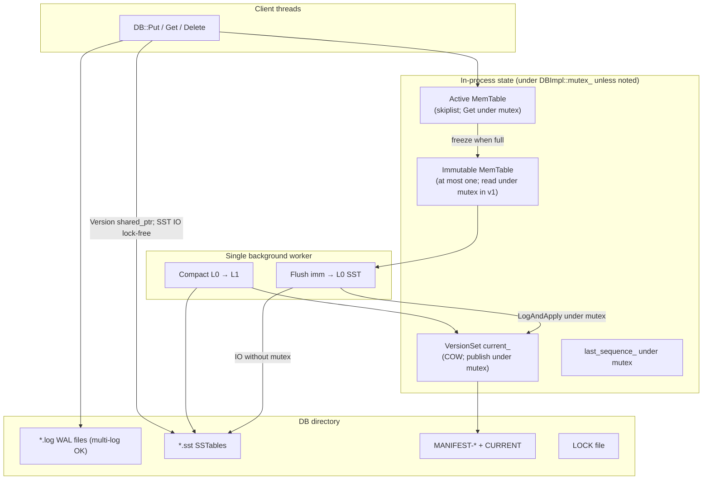
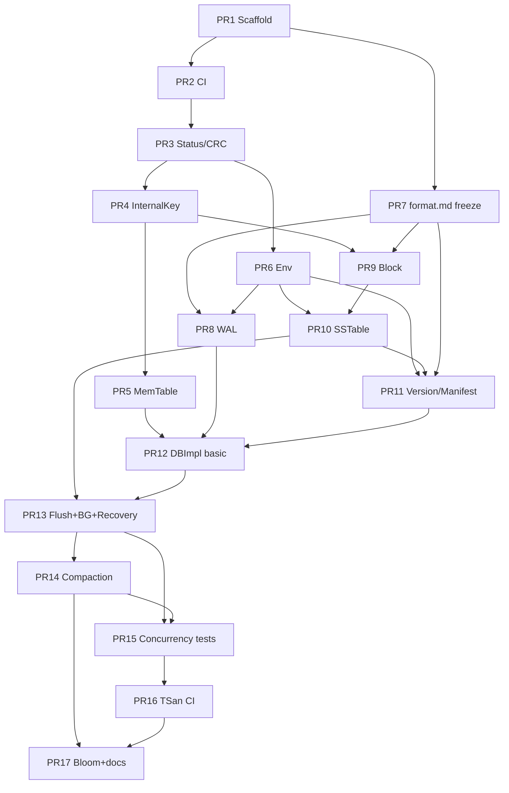

# Design Document: TinyLSM — Educational LSM-Tree Embedded Key-Value Storage Engine (C++)

| Field | Value |
|-------|--------|
| **Title** | TinyLSM: Educational LSM-Tree Embedded KV Engine |
| **Author** | TBD (`randomtiwary` / contributors) |
| **Date** | 2026-07-06 |
| **Status** | Draft (implementation-ready; editorial consistency pass) |
| **Repository** | `https://github.com/randomtiwary/tinylsm` (new implementation repo; greenfield tree) |
| **Language / Standard** | C++17 |
| **Build** | CMake 3.16+ |
| **Primary audience** | Senior engineers implementing and reviewing incremental PRs |
| **On-disk format version** | `TINYLSM1` (footer magic); freeze before flush-heavy PRs via `docs/format.md` |

---

## Overview

TinyLSM is a **from-scratch, single-process embedded key-value storage engine** built around the classic **Log-Structured Merge-Tree (LSM-Tree)** architecture. It exposes a minimal API — `Put`, `Get`, and `Delete` over byte-string keys and values — and implements the core educational path of production systems such as LevelDB and RocksDB: an ordered in-memory **MemTable** protected by a **write-ahead log (WAL)**, periodic **flush** to immutable **SSTables** on disk, a **manifest / version set** that tracks live files, **recovery** by replaying **all relevant WAL files** on open, and a simple **compaction** strategy to bound read amplification and reclaim space from overwritten or deleted keys.

The project prioritizes **correctness, clarity, and incremental reviewability** over peak performance. Concurrency is first-class: multiple readers and writers must interoperate safely with background flush/compaction under an explicit lock protocol (active memtable search under the DB mutex; SST IO outside the mutex via RAII-held `Version` refs). CI must exercise races under ThreadSanitizer with modest thread counts on GitHub runners. The implementation is staged into **~17 small PRs** (formats and recovery invariants specified early enough that PR 7+ implementers need not invent wire layouts).

---

## Background & Motivation

### Why an educational LSM engine?

LSM-trees are the dominant design for write-optimized storage (RocksDB, LevelDB, Cassandra, Scylla, WiredTiger’s LSM mode, etc.). Understanding them requires more than reading papers: the hard parts are **encoding on-disk formats**, **durability via WAL (including multi-log recovery after memtable freeze)**, **version publication without races**, and **tests that actually catch concurrency bugs**. A minimal but complete engine is an effective way to learn those interfaces end-to-end.

### Current state (implementation repo is greenfield)

The **GitHub repository `randomtiwary/tinylsm` is a greenfield implementation tree**: no code is imported as a dependency, and the public project history starts empty.

Prior personal educational experiments (e.g. a local `lsm-kv` tree elsewhere on a developer machine, or any unrelated remote with a similar name) are **out of tree and not dependencies**. They must not be copied into `tinylsm`. They may inform private notes about common pitfalls (WAL rotation vs `log_number`, COW versions, releasing the DB mutex during SST IO) but this design deliberately re-specifies formats and recovery so implementers do not reintroduce known durability bugs by incomplete folklore.

### Pain points this project addresses (learning objectives)

| Pain point | How TinyLSM addresses it |
|------------|---------------------------|
| “I know LSM theory but not file formats” | Byte-level SST + WAL + Manifest layouts in this doc and `docs/format.md`, with hex/round-trip tests |
| “Concurrency in storage is scary” | Explicit locking model, COW version set, mandatory correct locks in flush PR, TSan CI job, stress tests |
| “Big PRs are unreviewable” | Many small PRs; oversized subsystems split (block vs table; recovery vs TSan) |
| “Recovery is underspecified in tutorials” | WAL lifecycle state machine + crash-point matrix + early recovery tests with fault-injection hooks |

### Target load & educational performance envelope (not production SLOs)

| Metric | Educational target | Notes |
|--------|--------------------|-------|
| MemTable flush threshold | **4 MiB** default (configurable) | Small enough for fast tests |
| SSTable data block target | **4 KiB** (`Options::block_size`) | Cut when block would exceed |
| Max key / value size | **1 MiB** each (`Options::max_key_size` / `max_value_size`) | `InvalidArgument` if exceeded |
| Expected key/value size in tests | 8–256 B keys, up to ~1–4 KiB values | Stress may use larger within caps |
| Concurrent threads (local stress) | **8–32** writers/readers, **30–120 s** | Local / optional long job |
| Concurrent threads (**CI**) | **4–8** threads, **5–15 s** | Avoid flaky/slow TSan on GH runners |
| Single-threaded Put latency | Not optimized; order-of-magnitude **µs–tens of µs** with fsync optional | Durability mode selectable |
| Read path | MemTable → Immutable MemTable → L0…L1 SSTables (newest first where overlapping) | Bloom optional late |

**TSan policy**: aim for **zero suppressions**. If a suppression is ever required, it must be justified in the PR with a root-cause analysis (prefer fixing the race).

---

## Goals & Non-Goals

### Goals

1. **Correct single-key** `Put` / `Get` / `Delete` with last-write-wins semantics and delete tombstones.
2. **Durability**: after successful `Put`/`Delete` returns (in durable mode with `sync=true`), data survives process crash via WAL + fsync policy and multi-log replay.
3. **Recovery**: `DB::Open` rebuilds state from MANIFEST/SSTables and replays **every WAL file with number ≥ manifest `log_number`**, in ascending number order, into the memtable.
4. **Multithreading**: concurrent `Put`/`Get`/`Delete` from many threads without data races (TSan-clean).
5. **Compaction**: simple L0→L1 leveled strategy with precise tombstone-drop rules (bottommost + full input coverage).
6. **Testability**: exhaustive unit tests per component + multithreaded stress + recovery/crash matrix; CI builds and runs them (including a TSan job).
7. **Incremental delivery**: architecture and file layout support the PR plan without throwaway scaffolding; **byte formats frozen in design before PR 7+**.

### Non-Goals

- Distributed replication, multi-node consensus, or multi-process shared access to one DB directory (second `Open` fails on `LOCK`).
- SQL, secondary indexes, multi-key transactions, or user-visible snapshot isolation (v1 `Get` always uses the DB’s latest committed sequence at the start of the call).
- Encryption, compression (v1), or optional “no checksum” modes (checksums are mandatory).
- Network protocol / server mode.
- Production performance work: `io_uring`, hugepages, jemalloc tuning, SIMD, exotic allocators.
- Full RocksDB feature parity (column families, merge operators, transactions, backups, etc.).
- Public range `Iterator` API in v0.1 (internal iterators exist for flush/compaction only).

---

## Proposed Design

### High-level architecture



### Public API surface

Header: `include/tinylsm/db.h` (namespaced `tinylsm`).

```cpp
namespace tinylsm {

struct Options {
  size_t write_buffer_size = 4 * 1024 * 1024;  // memtable flush threshold
  size_t block_size = 4 * 1024;                // SST data block target
  size_t max_key_size = 1 * 1024 * 1024;
  size_t max_value_size = 1 * 1024 * 1024;
  int l0_compaction_trigger = 4;
  bool create_if_missing = true;
  bool error_if_exists = false;
  bool sync_writes = true;   // default durable educational mode
  int bloom_bits_per_key = 0; // 0 = disabled; set e.g. 10 in bloom PR
  // max_sstable_size: not enforced in v1 (single output file per compaction)
};

struct ReadOptions {
  // Reserved for post-v0.1 snapshot support. Ignored in v1.
  // Get always observes data at last_sequence_ sampled at start of Get (under mutex).
};

struct WriteOptions {
  bool sync = true;  // if true, fsync/fdatasync WAL before Put/Delete returns
};

class DB {
 public:
  // Open acquires LOCK; fails if lock held or options reject path state.
  static Status Open(const Options& options, const std::string& name, DB** dbptr);

  // Destructor == Close: set shutting_down_, wake BG, wait for idle,
  // optionally best-effort flush of imm if clean shutdown, release LOCK, join BG.
  // No separate Close() in v1 (document this; avoid double-close API surface).
  virtual ~DB();

  DB(const DB&) = delete;
  DB& operator=(const DB&) = delete;

  virtual Status Put(const WriteOptions& wo, const std::string& key,
                     const std::string& value) = 0;
  virtual Status Delete(const WriteOptions& wo, const std::string& key) = 0;
  virtual Status Get(const ReadOptions& ro, const std::string& key,
                     std::string* value) = 0;

  // Optional late PR: virtual Status GetProperty(const std::string& prop, std::string* val);
};

}  // namespace tinylsm
```

**API notes**:

- **Destructor = Close** (Issue 12): all resource release happens in `~DB` / `~DBImpl`. Callers must not use the `DB*` after delete.
- **`slice.h` / `iterator.h`**: **internal only** under `src/` (or non-installed headers). Public API uses `std::string`. Internal `Iterator` interfaces support flush and compaction merge only until a post-v0.1 public scan API.
- **No multi-op Write batch API in v0.1** (each Put/Delete is one WAL record).
- **`Status`**: `OK`, `NotFound`, `IOError`, `Corruption`, `InvalidArgument` in `include/tinylsm/status.h`.

### Integer endianness (global rule)

**All multi-byte integers on disk and in internal-key trailers use little-endian (LE)** unless an explicit exception is documented. This includes WAL lengths/CRCs, SST fixed widths, MANIFEST framing, and the internal-key 8-byte trailer. Varints use standard unsigned LEB128 (LevelDB-style).

### Internal key encoding

User keys alone are insufficient: overwrites and deletes need ordering. Every memtable/SSTable entry uses an **internal key**:

```
internal_key = user_key bytes || fixed64_le( (sequence << 8) | type )
type:  kTypeDeletion = 0,  kTypeValue = 1
```

- **Sequence numbers**: monotonically increasing `uint64_t`, allocated only under `DBImpl::mutex_`.
- **Packed tag**: low 8 bits = `type`; high 56 bits = `sequence` (max sequence effectively `2^56 - 1`, ample for education).
- **Comparator `CompareInternalKey(a, b)`**:
  1. Compare `user_key` with raw byte-wise ascending order (`memcmp` / `string` compare).
  2. If equal, compare `sequence` **descending** (higher sequence first).
  3. If still equal, compare `type` **descending** as unsigned 8-bit (`kTypeValue=1` before `kTypeDeletion=0` only matters if the same sequence were reused—which must not happen; still define total order).
- **Malformed keys**: internal keys shorter than 8 bytes are **corrupt**; builders never emit them; readers return `Corruption` if found in SST; memtable assumes well-formed inserts from DBImpl only.

**LookupKey for Get** (constructed once per Get under mutex after sampling sequence):

```text
MakeLookupKey(user_key, snapshot_seq):
  // Seek key that sorts before any real key with (user_key, seq<=snapshot_seq)
  // Encode: user_key || fixed64_le( (snapshot_seq << 8) | kTypeValue )
  // With comparator (seq descending), seeking this finds the newest entry
  // with seq <= snapshot_seq for that user_key when iterating forward.
```

**v1 visibility**: `snapshot_seq = last_sequence_` sampled at the start of `Get` while holding `mutex_`. `ReadOptions` does not override this. No MVCC snapshots.

**Delete semantics**: append a deletion tombstone (`kTypeDeletion`, empty value) with a new sequence. Physical removal only at compaction under the **bottommost tombstone rule** (§ Compaction).

Implementation: `src/internal_key.h`, `src/internal_key.cpp` (not part of installed public API unless desired later).

---

### Component design

#### 1. Skiplist MemTable

**Why skiplist (preferred)** vs sorted `std::vector` / `std::map`:

| Structure | Pros | Cons | Educational fit |
|-----------|------|------|-----------------|
| **Skiplist** | Probabilistic balance, ordered iteration, classic LSM teaching tool, O(log n) insert/lookup | Slightly more code | **Best** |
| `std::map` | Trivial, correct | Opaque RB-tree | Weaker pedagogy |
| Sorted vector | Cache locality | O(n) insert for active table | Immutable-only niche |

**API sketch**:

```cpp
class MemTable {
 public:
  explicit MemTable(const InternalKeyComparator& cmp);
  void Add(SequenceNumber seq, ValueType type,
           const std::string& key, const std::string& value);
  // LevelDB-like contract (single normative Get contract for MemTable and DB):
  //   - Returns true if this memtable has an entry for the user key (value or deletion).
  //   - On value hit: *s = OK, *value = payload, return true.
  //   - On deletion tombstone (newest type for key): *s = NotFound, return true
  //     (caller must NOT search older layers — key is deleted).
  //   - On miss: return false (*s unchanged); caller continues to imm / Version / SST.
  // DB::Get maps: true+OK → return value; true+NotFound → NotFound; all miss → NotFound.
  bool Get(const LookupKey& k, std::string* value, Status* s) const;
  size_t ApproximateMemoryUsage() const;
  // Internal iterator for flush (ordered by InternalKeyComparator)
};
```

**Concurrency (v1 — mandatory)**:

- Skiplist is **not** thread-safe for concurrent mutation + read.
- **Active and immutable memtable `Get`/`Add` occur only while holding `DBImpl::mutex_`** (simplest TSan-correct model).
- Immutable memtable has **no writers** after freeze, but v1 still searches it **under the mutex** for uniformity and to avoid subtle lifetime races. (A later optimization may search `imm` via `shared_ptr` without the mutex; not v1.)
- Hold `shared_ptr<MemTable>` for `mem_` and `imm_` so lifetime outlasts freeze/flush handoff.

#### 2. WAL (Write-Ahead Log) — full format

**Purpose**: survive crash of unflushed memtable data across **one or more** log files.

**File naming**: `{number}.log` where `number` is a decimal integer (no required zero-pad width for correctness; helpers may zero-pad for readability, e.g. 6 digits). Parse by trailing path component matching `^[0-9]+\.log$`.

##### 2.1 Physical record layout

One record = one logical Put or Delete (no multi-record fragmentation in v1).

```
offset 0:  fixed32_le length          // number of bytes in `payload` only
offset 4:  fixed32_le crc32c_masked   // CRC of `payload` only, then masked
offset 8:  payload[length]
```

**No separate physical “type” byte** on the frame (v1 does not implement LevelDB-style first/middle/last fragments). The payload’s `value_type` distinguishes value vs deletion.

**CRC**:

- Algorithm: **CRC-32C** (Castagnoli polynomial `0x1EDC6F41`), same as LevelDB/RocksDB intent for hardware-friendly CRC.
- Compute `crc = crc32c(payload)`.
- **Mask** (LevelDB-compatible masking to avoid embedded CRC confusion), all `uint32_t` modular arithmetic:
  ```
  masked = ((crc >> 15) | (crc << 17)) + 0xa282ead8u
  ```
- Store `masked` as `fixed32_le`.
- **Unmask** (inverse; mandatory on every read path — WAL, SST block trailer, MANIFEST):
  ```
  unmasked = masked - 0xa282ead8u
  crc      = (unmasked << 15) | (unmasked >> 17)
  ```
- Verify: recompute `crc32c` over protected bytes and compare to unmasked `crc`. PR 3 unit tests must include mask→unmask round-trip and at least one known-vector pair.

**Payload encoding**:

```
fixed64_le sequence
u8         value_type        // 0 = deletion, 1 = value
varint32   key_len
key_bytes[key_len]
varint32   val_len           // 0 for deletion
val_bytes[val_len]
```

##### 2.2 Writer behavior

- Append full record atomically from the writer’s perspective (single `Append` of the framed bytes or write length+crc+payload without interleaving other writers — enforced by holding `DBImpl::mutex_` during WAL write).
- If `WriteOptions.sync == true` (or options default): call **`fdatasync`** on the log fd (or `fsync` if `fdatasync` unavailable). Prefer `fdatasync` when possible.
- After **creating** a new log file (open/creat), **`fsync` the parent directory** best-effort so the directory entry is durable on crash (POSIX; ignore errors only if documented as best-effort, but try).
- Do not recycle log file numbers.

##### 2.3 Reader behavior (recovery scan)

For each log file, read sequentially:

1. If fewer than 8 bytes remain → **stop successfully** (clean EOF or empty file).
2. Read `length`, `crc_masked`. If the file does not contain a full 8-byte header, or
   `8 + length` would exceed file size (cannot read full payload) → **stop successfully**
   (torn tail; drop incomplete final record). This is **not** `Corruption`.
3. Read full `payload[length]`. Unmask CRC and verify over `payload` only.
   - **Full payload read + CRC mismatch → `Status::Corruption`**, even if this is the last
     record at EOF. A complete framed record with a bad CRC is bitrot or a bug, not a tear.
     Tears are already handled by the length/EOF checks in steps 1–2.
4. Decode payload; yield `(seq, type, key, value)`.

##### 2.4 WAL lifecycle & recovery invariants (critical)

**Definitions** (all under the VersionSet / MANIFEST notion of metadata):

| Field | Meaning |
|-------|---------|
| `manifest_log_number` (persisted as `VersionEdit` / VersionSet `log_number_`) | **Smallest log number that may still contain data not yet reflected in any live SSTable.** Recovery must replay **all** `*.log` files with `number >= manifest_log_number`, sorted ascending. |
| `current_log_number_` (in-memory, DBImpl) | Log file currently appended by writers for the **active** memtable. |
| `imm_log_number_` (in-memory) | While `imm_` is non-null, the log number that contains the frozen memtable’s records (the log that was current at freeze). |

**When does `manifest_log_number` advance?**

- **Only in `LogAndApply` when a flush completes successfully**, as part of the same `VersionEdit` that **adds the new L0 SSTable**. Set `log_number = new_active_log_number` (the log created for the memtable that replaced the one just flushed), meaning: “all data from logs **strictly older** than this number that belonged to flushed memtables is now in SSTables; recovery may start at this number.”
- **Freeze must NOT call `LogAndApply` solely to publish a new log number.** Freeze is an in-memory + filesystem open of a new log file only.

**Freeze / rotate sequence (writers, under `mutex_`)**:

```text
// mem_ full and imm_ == nullptr
imm_ = mem_
imm_log_number_ = current_log_number_
mem_ = new MemTable
current_log_number_ = versions_->NewFileNumber()   // allocate number
Open new WAL file current_log_number_.log          // fsync dir best-effort
// DO NOT update manifest log_number yet
Schedule BG flush of imm_
```

**Flush completion (BG, see lock protocol)**:

**File-number allocator API (normative — VersionSet)**:

```text
NewFileNumber()        // ALLOCATE:  return next_file_number_++   (only allocator)
PeekNextFileNumber()   // GETTER:    return next_file_number_     (no side effects)
// Do NOT name a method NextFileNumber() — ambiguous and hazard-prone.
```

On `LogAndApply` when an edit carries `kNextFileNumber`:

```text
next_file_number_ = max(next_file_number_, edit.next_file_number)
// Never lower the live counter below what the process has already allocated.
```

**Flush completion (BG, see lock protocol)**:

```text
// After SST file fully written + fsynced + renamed into place:
edit.AddFile(level=0, file_meta...)
edit.SetLogNumber(current_log_number_)  // active log after freeze; recovery replays it fully
edit.SetNextFileNumber(versions_->PeekNextFileNumber())  // persist high-water; NO allocate
edit.SetLastSequence(last_sequence_)    // GLOBAL high-water (may include active-mem seqs
                                        // not yet in any SST — safe only because recovery
                                        // ALWAYS applies every complete WAL record; see Open step 8)
LogAndApply(edit)   // under mutex_; may max() next_file_number_ with edit value
// Now safe to delete log files with number < new manifest_log_number
// that are not still required — i.e. numbers in [old_manifest_log, new_manifest_log)
// After apply: imm_ = nullptr; imm_log_number_ clear; notify write stall waiters
```

**Manifest `last_sequence` semantics**: it is a **global sequence high-water mark**, not
“max sequence present only in SSTables.” It may be **ahead of** SST-resident data whenever
the active memtable has newer synced keys. Recovery must therefore **never** skip WAL records
based on `seq <= manifest_last_sequence` (see Open **step 8**).

**Important**: Between freeze and flush apply, **two (or more) log files** exist that recovery must replay: the imm log and the active log (and any older logs ≥ old `manifest_log_number` if a previous flush had not advanced it—normally just imm+active).

**Crash-point matrix**:

| Crash point | Durable state | Required recovery action | Expected user-visible data |
|---|---|---|---|
| After WAL sync + mem `Add`, before freeze | Record in `current_log` | Replay all logs ≥ `manifest_log_number` (includes current) | Synced keys present |
| After freeze + new log opened, **before** L0 SST durable / manifest apply | Old log has imm data; new log has later puts; manifest still has **old** `log_number` | Replay **old and new** (all `*.log` ≥ manifest log number) in number order | Imm + active data both restored into memtable |
| After SST durable + `LogAndApply` advanced `log_number` + obsolete log GC | SST has imm data; manifest points past old log | Replay only logs ≥ new `log_number`; old log may be absent | Data in SST or remaining logs |
| After SST bytes written, **before** `LogAndApply` | Orphan `*.sst` not in manifest; logs still hold data | Ignore orphan SST; replay logs as above | Data from logs; orphan deleted on obsolete scan optional |
| Mid-compaction new SST written, before apply | Orphan output SST; inputs still in manifest | Ignore orphan; inputs remain live | Unchanged logical data |

**Open() recovery algorithm (normative)**:

```text
1. Acquire directory LOCK (flock exclusive). Fail Open if unavailable.

2. **NewDB path** (no CURRENT and create_if_missing):
     Create empty Version; write MANIFEST-1 with SetComparator, SetLogNumber(1),
       SetNextFileNumber(2), SetLastSequence(0); write CURRENT → MANIFEST-1 (temp+rename);
       create empty 1.log on disk; fsync dir best-effort.
     In-process init (mandatory — disk files alone are not enough):
       mem_ = new empty MemTable
       imm_ = nullptr
       current_log_number_ = 1
       last_sequence_ = 0
       log_number_ / manifest_log_number = 1
       next_file_number_ = 2   // PeekNextFileNumber() == 2; NewFileNumber() first returns 2
       Open WalWriter appending to 1.log
     Go to step 10 (start BG; return OK). First Put/Get must work with no lazy init.

   If no CURRENT and !create_if_missing → return InvalidArgument / IOError.
   If CURRENT exists and error_if_exists → return error.

3. Read CURRENT (must be single line filename + optional newline). Open that MANIFEST.
4. Replay all VersionEdit records in MANIFEST → rebuild Version, next_file_number_,
   last_sequence_ (global high-water metadata), log_number_ (= manifest_log_number).
5. Open all live SSTables referenced by Version; missing file → Corruption/IOError.
6. List directory. Parse numeric file numbers from:
     - `([0-9]+)\.log`
     - `([0-9]+)\.sst`  (and ignore `*.sst.tmp` / treat temp as max candidate if present)
     - `MANIFEST-([0-9]+)`
   Let max_found = maximum of all such numbers found (0 if none).
   **Bump allocator (mandatory — freeze may have created N.log without persisting next_file_number):**
     next_file_number_ = max(next_file_number_from_manifest, max_found + 1)
   Never allocate a number that already exists on disk.
7. Collect all log numbers N where `N.log` exists and N >= manifest_log_number.
   Sort ascending. If empty: allocate N = NewFileNumber(), create N.log, open for append;
   rebuilt memtable stays empty; go to step 9 with that empty memtable.
8. WAL replay (normative — **always apply every complete record**):
     wal_max_seq = 0
     recovery_mem = new empty MemTable
     For each log number N in sorted list:
       Open N.log; for each complete record (per §2.3):
         recovery_mem.Add(record.seq, record.type, record.key, record.value)
           // ALWAYS apply. Do NOT skip when record.seq <= manifest last_sequence.
           // Rationale: after flush, manifest last_sequence is the GLOBAL high-water and
           // may include active-mem sequences whose only copy is still the active log.
           // Skipping those records loses durable keys (silent data loss).
           // Re-adding keys already in SSTs is safe: Get searches memtable first; same seq
           // duplicate is identical; older seq in mem lost to newer on overwrite within mem.
         wal_max_seq = max(wal_max_seq, record.seq)
     last_sequence_ = max(manifest_last_sequence, wal_max_seq)
9. Install in-process write state (existing-DB path):
     mem_ = recovery_mem   // or empty mem from step 7
     imm_ = nullptr
     current_log_number_ = highest existing log ≥ manifest_log_number (recommended append target)
     Open WalWriter appending to current_log_number_.log
       (Do not reuse numbers below PeekNextFileNumber().)
   **Post-recovery flush if oversized (operability):**
     if mem_->ApproximateMemoryUsage() >= options.write_buffer_size:
       // Before returning from Open: freeze mem_ → imm_, open new WAL via NewFileNumber(),
       // schedule BG flush (or run synchronous flush if BG not yet started — either OK).
       // Ensures Open does not leave an unbounded memtable that only shrinks on first write.
10. Start background worker thread (if not already running for step 9 flush); return OK.
    // Invariant at return: mem_ non-null, WalWriter open on current_log_number_, LOCK held,
    // BG running. No lazy init on first Put.
```

**Why “always apply” is required (failure mode forbidden by this rule):**

1. Write keys A (seqs 1..N) until freeze; imm holds A.
2. Write keys B (seqs N+1..M) to active; flush of imm applies with `SetLastSequence(M)` and
   `SetLogNumber(active_log)`.
3. Crash. SST has A; active log has B; manifest `last_sequence = M`.
4. If recovery skipped `seq <= M`, B would be lost. **Always-apply restores B into mem_.**

**Log garbage collection**: only delete `K.log` when `K < manifest_log_number` **after** a successful `LogAndApply` that advanced `log_number`, and never delete a log still equal to `current_log_number_` / open for write.

**Critical risk R0**: updating `manifest_log_number` at freeze time (without SST apply) → **silent data loss** on crash. **Forbidden.**

**Critical risk R0b**: skipping WAL records with `seq <= manifest last_sequence` → **silent data loss** of active-log keys after a successful imm flush. **Forbidden.** Always apply every complete record (Open **step 8**).

**Critical risk R0c**: failing to bump `next_file_number_` past on-disk max after freeze-created logs → file-number reuse / WAL or SST path collisions. **Forbidden.** Open **step 6** is mandatory.

Files: `src/wal.h`, `src/wal.cpp`.

#### 3. SSTable format (v1) — full byte layout

**File layout (in order)**:

```
[ data block 0 ][ data block 1 ]...[ data block N-1 ]
[ meta / filter block? ]   // absent in v1 if bloom disabled (filter_handle = 0,0)
[ index block ]
[ footer ]                 // fixed 48 bytes at EOF
```

v1 with bloom disabled: **no filter block**; only data blocks, then index block, then footer.

##### 3.1 Block trailer (every block: data, index, filter)

Each block is:

```
block_contents[length]
u8  compression_type     // always 0 = kNoCompression in v1
fixed32_le crc32c_masked // CRC over (block_contents || compression_type byte)
```

**Normative (only)**: `BlockHandle = (offset, size)` refers to **`block_contents` bytes only**
(not including the 5-byte trailer). Reader reads `size` bytes at `offset`, then reads the
5-byte trailer at `offset+size` for `compression_type` + masked CRC. Index and footer handles
always use this convention.

##### 3.2 Data block contents (v1 — raw keys, restart array)

**No prefix compression in v1.** Entry format:

```
varint32 key_len
key_bytes[key_len]           // full internal key
varint32 value_len
value_bytes[value_len]
```

**Restart points**: every `kBlockRestartInterval = 16` entries, record the offset (from start of block_contents) of that entry in a restart array. Restarts allow binary search even without prefix compression (seek to restart, linear scan within interval).

Block_contents layout:

```
[entries...]
fixed32_le restart_offset[0]
fixed32_le restart_offset[1]
...
fixed32_le restart_offset[R-1]
fixed32_le num_restarts        // R
```

**Empty table**: `TableBuilder::Finish` on zero keys still writes an empty data block (or zero data blocks), an index block with **zero** entries, and a valid footer. Reader returns NotFound for all Gets. (Prefer **one empty data block** + empty index for simpler code paths.)

##### 3.3 Index block

Index block uses the **same block entry encoding** as data blocks, where:

- **key** = **separator internal key**: the **shortest** byte string that is ≥ all keys in the previous data block and < all keys in the next data block is ideal; **v1 may use the full last internal key of the data block** as the index key (simpler, slightly larger index). **Normative v1: use the last internal key of the block** as the index entry key.
- **value** = encoded `BlockHandle`: `varint64 offset | varint64 size` (contents size).

Binary search in the index finds the first index entry with key ≥ lookup key’s user-key seek form, then loads that data block.

##### 3.4 Footer (exactly 48 bytes at EOF)

```
offset from EOF-48:
  0:  fixed64_le index_handle.offset
  8:  fixed64_le index_handle.size      // size of index block_contents
 16:  fixed64_le filter_handle.offset   // 0 if no filter
 24:  fixed64_le filter_handle.size     // 0 if no filter
 32:  fixed64_le padding_or_version     // must be 0 for TINYLSM1
 40:  fixed64_le magic
```

**Magic** (both forms normative):

- ASCII: `TINYLSM1` (8 bytes: `0x54 0x49 0x4E 0x59 0x4C 0x53 0x4D 0x31`)
- As a little-endian `uint64_t` integer value on a LE host: interpret those 8 bytes in file order (do **not** byte-swap the ASCII). Readers compare 8-byte sequence to `"TINYLSM1"`.

**Bloom later**: set non-zero `filter_handle`; **same magic `TINYLSM1`** (filter_handle zero means “no filter”). No format bump required for optional bloom.

##### 3.5 Block size policy

`TableBuilder` starts a new data block when `current_block_bytes >= Options::block_size` (default **4096**) **after** finishing an entry (never split an entry across blocks).

##### 3.6 Builder durability

- Write to `{number}.sst.tmp` (or `Env` temp), `fdatasync` file, `rename` to `{number}.sst`, best-effort `fsync` directory.
- On `Finish` failure: **delete partial temp/SST file**.
- `LogAndApply` only after successful durable SST publish.

##### 3.7 Reader concurrency

Immutable file; **`pread` + heap buffer** (not mmap in v1). No block cache in first SST PRs.

Hex/round-trip tests in PR for empty table, single key, multi-block, CRC corruption.

#### 4. Flush: MemTable → SSTable

Trigger: after a successful write, if `mem_->ApproximateMemoryUsage() >= options.write_buffer_size` and `imm_ == nullptr`, freeze and schedule flush. If mem full and `imm_ != nullptr`, **write stall** (`cv.wait`).

```mermaid
sequenceDiagram
  participant W as Writer
  participant DB as DBImpl mutex
  participant BG as BG worker
  participant VS as VersionSet

  W->>DB: lock; MakeRoomForWrite
  alt imm pending and mem full
    W->>DB: cv.wait until imm cleared or bg_error_
  end
  W->>DB: WAL append + optional sync; mem Add
  alt mem over limit and imm null
    W->>DB: freeze mem→imm; new mem; open new WAL (no manifest log advance)
    W->>DB: schedule flush; notify BG
  end
  W->>DB: unlock
  BG->>BG: lock; claim flush; unlock
  BG->>BG: build SST from imm iterator (no mutex)
  BG->>DB: lock; LogAndApply(add L0, SetLogNumber); imm=null; notify; unlock
```

**Educational choice**: single **background worker thread** (not sync flush on write path). **Locking model in §10 is mandatory when BG flush lands (PR “flush”), not deferred to a later “hardening” PR.**

**Invariant**: at most **one** immutable memtable.

#### 5. Version set & manifest (copy-on-write) — full format

**In-memory lifetime model (normative — pick one; v1 uses this only)**:

Use **`std::shared_ptr<Version>`** for published versions. Each `Version` **owns** its
`FileMetaData` by value (no intrusive `FileMetaData::refs`, no raw `Version* current_`
without a shared_ptr owner). When the last `shared_ptr<Version>` that references a given
file number is destroyed, that file becomes eligible for unlink **if** it is not in the
live `current_` version (track deleted-but-still-referenced files in `VersionSet` pending
set, or scan: unlink numbers not present in `current_` and not held by any other live
`Version` — simplest education: keep `std::shared_ptr<FileMetaData>` inside each Version
so files are shared across versions that still list them; unlink when `use_count` hits 0
after a version drops them).

```cpp
struct FileMetaData {
  uint64_t number;
  uint64_t file_size;
  InternalKey smallest, largest;
  // no intrusive refs — lifetime via shared_ptr<FileMetaData> shared across Versions
};

// Version is immutable after publication.
class Version : public std::enable_shared_from_this<Version> {
 public:
  // levels_[0] = L0, levels_[1] = L1
  // L0: sorted by file number ascending (Get searches newest-first = reverse)
  // L1: sorted by smallest user key; non-overlapping ranges
  std::vector<std::shared_ptr<FileMetaData>> levels_[2];
};

class VersionSet {
  // NO separate mutex in v1. All methods called with DBImpl::mutex_ held.
  std::shared_ptr<Version> current_;
  uint64_t next_file_number_;   // next number to allocate; never decrease on LogAndApply
  uint64_t last_sequence_;      // GLOBAL sequence high-water (see §2.4); not SST-only
  uint64_t log_number_;         // manifest_log_number — multi-log recovery base
  uint64_t manifest_file_number_;

  uint64_t NewFileNumber() { return next_file_number_++; }       // ALLOCATE only
  uint64_t PeekNextFileNumber() const { return next_file_number_; }  // GETTER only
  // No NextFileNumber() method — name reserved to avoid allocate-vs-peek confusion.

  Status LogAndApply(VersionEdit* edit); // requires DB mutex held
  // On edit kNextFileNumber: next_file_number_ = max(next_file_number_, edit.value)
  // Prefer holding mutex during small MANIFEST append. SST build stays off-mutex.
};
```

**Obsolete SST unlinking**: only after successful `LogAndApply` removes a file from the live
set **and** no remaining `shared_ptr<FileMetaData>` / `shared_ptr<Version>` still references
it (e.g. an old Version held by an in-flight Get). Never unlink compaction inputs before
apply; never unlink merely because a new file was written.

##### 5.1 VersionEdit payload (logical tags)

Encode as a concatenation of tagged fields (LevelDB-inspired). Each field:

```
varint32 tag
// then type-specific body
```

| Tag | Name | Body |
|-----|------|------|
| 1 | `kComparator` | `varint32 len \| bytes` (optional; must match `"leveldb.BytewiseComparator"` or `"tinylsm.BytewiseComparator"` — pick **`tinylsm.BytewiseComparator`**) |
| 2 | `kLogNumber` | `varint64 log_number` |
| 3 | `kNextFileNumber` | `varint64` |
| 4 | `kLastSequence` | `varint64` |
| 5 | `kCompactPointer` | **unused in v1** (skip if present for forward compat) |
| 6 | `kDeletedFile` | `varint32 level \| varint64 file_number` |
| 7 | `kNewFile` | `varint32 level \| varint64 file_number \| varint64 file_size \| encoded smallest internal key (len+bytes) \| encoded largest internal key` |
| 9 | `kPrevLogNumber` | **unused in v1** (ignore if present) |

##### 5.2 MANIFEST physical framing

MANIFEST is an append-only file of records:

```
fixed32_le record_len
fixed32_le crc32c_masked(payload)   // same mask as WAL; CRC of payload only
payload[record_len]                 // one VersionEdit byte stream
```

**CRC on MANIFEST: yes** (symmetric with WAL; cheap educational consistency).

##### 5.3 CURRENT atomicity

- Write file `CURRENT.tmp` containing `MANIFEST-{n}\n`.
- `fsync` temp file; `rename` over `CURRENT`; best-effort `fsync` directory.
- **Never** truncate `CURRENT` in place.

##### 5.4 NewDB

Create:

1. Empty `Version`.
2. `MANIFEST-1` with one edit: `SetComparator`, `SetLogNumber(1)`, `SetNextFileNumber(2)`, `SetLastSequence(0)`.
3. `CURRENT` → `MANIFEST-1`.
4. Create empty or header-only `1.log` ready for append.
5. LOCK already held by Open.

##### 5.5 Levels policy

- **L0**: flush outputs; key ranges may overlap; Get searches **newest file number first**.
- **L1**: non-overlapping; Get binary-searches by user key range.
- Compact when `L0 file count >= Options::l0_compaction_trigger` (default 4).

#### 6. Compaction — precise rules

**Trigger**: after flush `LogAndApply`, if L0 size ≥ trigger, schedule compaction on BG queue (or run after flush on same worker).

**Input selection (normative)**:

1. **`inputs[0]` = all L0 files** when `L0_count >= l0_compaction_trigger` (v1 normative;
   simplest correctness: full L0 coverage so no older L0 version of a key can sit outside inputs).
2. `range = [min smallest.user_key, max largest.user_key]` over `inputs[0]`.
3. `inputs[1]` = **every L1 file whose user-key range overlaps `range`** (inclusive overlap on user keys).
4. **Invariant**: outputs of this compaction **replace exactly `inputs[0] ∪ inputs[1]`**. Any L1 file not in `inputs[1]` is untouched. Therefore, for any user key that appears in the merge, **no older version of that key can exist in L1 outside the inputs**, because all overlapping L1 files were included. Older versions cannot exist in L0 outside inputs because all L0 files were included. With only two levels, L1 is **bottommost**.

**Merge**:

1. Build merging iterator over all input files ordered by `InternalKeyComparator`.
2. For each distinct `user_key` group in order: consider internal keys from newest to oldest within the group (iterator natural order already newest-first per user key because of comparator).
3. **Emit at most one** internal key per `user_key`: the first (newest) seen.
4. **Tombstone drop rule (bottommost)**: if that newest key has `type == kTypeDeletion` **and** this compaction’s outputs land at bottommost level (L1) **and** input selection invariant above holds → **drop** (emit nothing for that user key). Otherwise emit the deletion.
5. Older keys in the same user_key group are always dropped (superseded).

**Output**:

- **v1: single output SSTable** at L1 (simplest). If the merge is huge, educational tests use small data; optional later `max_sstable_size` split with consecutive non-overlapping key ranges.
- Write output with same builder durability rules; `VersionEdit`: `DeleteFile` each input; `NewFile` level=1 for output; do **not** change `log_number` on compaction-only edits unless needed.

**Get vs compaction ordering consistency**: Get on L0 scans files by **descending file number**; merge iterator uses internal key order across files—both agree that higher sequence wins globally.

**Tests (required)**:

- Delete key whose value lives only in an older non-selected file must not happen given “all L0 + all overlapping L1”; add a regression that **wrongly omitting an overlapping L1 file would surface as resurrected keys**—implement selection carefully.
- Overwrite chains across multiple L0 files; Get after compaction equals Get before for a snapshot of keys.
- Reader holds old `Version` while compaction applies; files remain readable until Unref; then unlinked.

#### 7. Recovery on Open

See §2.4 Open algorithm and crash matrix. Diagram:

```mermaid
sequenceDiagram
  participant Open as DB::Open
  participant FS as Filesystem
  participant MAN as Manifest
  participant WAL as WALs >= log_number
  participant MT as MemTable

  Open->>FS: Acquire LOCK
  alt NewDB
    Open->>FS: Create MANIFEST/CURRENT/1.log
    Open->>MT: empty mem_ + WalWriter on 1.log
  else Existing DB
    Open->>FS: Read CURRENT (atomic file)
    Open->>MAN: Replay VersionEdits → Version
    Open->>FS: Open live SSTables only
    Open->>FS: Bump next_file_number past max on-disk number
    Open->>FS: List *.log, filter number >= log_number, sort
    Open->>WAL: Always-apply each complete record into MemTable
    Open->>MT: last_sequence_ = max(manifest, wal_max); install WalWriter
  end
  Open->>Open: Start BG thread; return with mem_ + writer ready
```

**Fault injection for tests** (test-only hooks behind `#ifndef NDEBUG` or `TINYLSM_TEST_HOOKS`):

- `TEST_CrashAfterFreeze()` / sync points between freeze and flush apply.
- `TEST_SkipLogAndApplyAfterSstWrite()` to leave orphan SST.
- Prefer structured hooks over real `kill` in unit tests; optional integration test may `_exit(0)` after fsync.

#### 8. Bloom filters (optional, late PR)

- Bits per key from options (e.g. 10); double hashing; stored as filter block; `filter_handle` non-zero; magic unchanged.
- No false negatives allowed; tests check that.

#### 9. Environment abstraction

`Env`: `NewWritableFile`, `NewSequentialFile`, `NewRandomAccessFile`, `RenameFile`, `RemoveFile`, `CreateDir`, `ListDir`, `LockFile`/`UnlockFile`, `FsyncDir`, `NowMicros`.

POSIX implementation. **SST reads: `pread`**. **Not mmap in v1** (TSan clarity, explicit IO sizes).

#### 10. Concurrency model (critical, normative)

**Single lock authority**: **`DBImpl::mutex_` only** for DB state (memtables, version pointer, BG scheduling, sequence, bg_error_). **VersionSet has no nested mutex in v1.**

| Resource | Protection |
|----------|------------|
| Active/imm memtable Add/Get | `mutex_` held |
| WAL append + sync | `mutex_` held (educational; serializes writers on fsync) |
| `current_` Version publish | `mutex_` held in `LogAndApply` |
| SST data IO / table build | **mutex released** |
| Long Version::Get disk read | `shared_ptr<Version>` (or Ref/Unref RAII) held; **mutex not held** |
| File delete | After apply + refcount 0 |
| `bg_error_` | Set under mutex; writers fail sticky |

##### 10.1 Get path (fixed)

```text
std::string Get(key):
  std::lock_guard lg(mutex_)
  if (bg_error_) return bg_error_
  snapshot_seq = last_sequence_
  LookupKey lkey(key, snapshot_seq)
  // Active + immutable search UNDER LOCK (no concurrent Add race)
  if (mem_->Get(lkey, &value, &s)) return s
  if (imm_ && imm_->Get(lkey, &value, &s)) return s
  std::shared_ptr<Version> v = current_version_shared_  // or Ref() into RAII
  // unlock via end of scope carefully — use unique_lock:
```

Preferred structured form:

```text
Status DBImpl::Get(...) {
  std::unique_lock<std::mutex> lk(mutex_);
  if (!bg_error_.ok()) return bg_error_;
  SequenceNumber snap = last_sequence_;
  LookupKey lkey(key, snap);
  std::string value;
  Status s;
  if (mem_->Get(lkey, &value, &s)) return s;
  if (imm_ && imm_->Get(lkey, &value, &s)) return s;
  auto version = current_;  // shared_ptr copy bumps ref
  lk.unlock();              // disk IO without mutex
  s = version->Get(options, lkey, &value);  // SST only
  // version destructor Unrefs automatically (RAII) — no missing Unref paths
  return s;
}
```

**Mandate RAII** (`shared_ptr<Version>` or `VersionHandle` with destructor Unref). Manual Unref outlines are forbidden in implementation PRs.

##### 10.2 Put path / MakeRoomForWrite

```text
Status DBImpl::Put(wo, key, value):
  if key/value size > limits: return InvalidArgument
  unique_lock lk(mutex_)
  Status st = MakeRoomForWrite(/*force=*/false)
  if (!st.ok()) return st
  seq = ++last_sequence_
  st = wal_->AddRecord(Encode(seq, type, key, value), wo.sync)
  if (!st.ok()) { bg_error_ or return; }
  mem_->Add(seq, kTypeValue, key, value)
  if (mem_->ApproxUsage() >= write_buffer_size && imm_ == nullptr)
    FreezeMemTableLocked()  // sets imm_, new mem_, new wal file; Schedule BG
  return OK

MakeRoomForWrite(force):
  while (true) {
    if (!bg_error_.ok()) return bg_error_
    if (shutting_down_) return IOError("closing")
    if (imm_ != nullptr && mem_->ApproxUsage() >= limit) {
      // stall: wait for BG to finish flush
      background_work_finished_cv_.wait(lk)
      continue
    }
    if (mem_->ApproxUsage() >= limit && imm_ == nullptr) {
      FreezeMemTableLocked()
      // loop to check again or return OK to allow current write on new mem
    }
    return OK
  }
```

WAL fsync under mutex is accepted for education (serializes writers).

##### 10.3 Background worker protocol

**Work predicates (normative)**:

```text
has_work     = (imm_ != nullptr) || compaction_scheduled_ || bg_working_
// bg_working_ = true while this thread has claimed a flush/compaction and has not yet
//               finished LogAndApply (or recorded bg_error_) for that claim.
// compaction_scheduled_ = true after MaybeScheduleCompactionLocked until Pick runs.
```

```text
BGMain:
  unique_lock lk(mutex_)
  while (!shutting_down_ || has_work) {
    while (!has_work && !shutting_down_) bg_cv_.wait(lk)
    if (shutting_down_ && !has_work) break

    // Prefer flush over compaction. On clean shutdown with imm_ pending and no bg_error_,
    // still run the flush to completion (do not abandon a claimed imm without apply unless
    // WriteLevel0Table fails — then set bg_error_ and exit; WALs remain for recovery).
    if (imm_ != nullptr) {
      auto imm = imm_  // shared_ptr
      bg_working_ = true
      // do not clear imm_ yet
      lk.unlock()
      Status s = WriteLevel0Table(imm)  // build SST file on disk
      lk.lock()
      if (!s.ok()) {
        bg_error_ = s
        bg_working_ = false
        background_work_finished_cv_.notify_all()
        continue  // or break if shutting_down_
      }
      VersionEdit edit
      edit.AddFile(0, meta)
      edit.SetLogNumber(current_log_number_)
      edit.SetLastSequence(last_sequence_)  // GLOBAL high-water; recovery always-applies WAL
      edit.SetNextFileNumber(versions_->PeekNextFileNumber())  // getter only; see §2.4 API
      s = versions_->LogAndApply(&edit)  // still holding mutex; max() live counter with edit
      if (!s.ok()) { bg_error_ = s; ... }
      else {
        // delete obsolete logs < log_number; drop imm shared_ptr
        imm_ = nullptr
        RemoveObsoleteFiles()  // only unlinked when no Version/FileMeta still refs
      }
      bg_working_ = false
      background_work_finished_cv_.notify_all()
      MaybeScheduleCompactionLocked()
      continue
    }
    if (compaction_scheduled_ || needs_compaction()) {
      compaction_scheduled_ = false
      Compaction c = PickCompaction()
      bg_working_ = true
      lk.unlock()
      s = DoCompaction(c)  // IO
      lk.lock()
      if (s.ok()) LogAndApply(compaction edit)
      else bg_error_ = s
      bg_working_ = false
      notify waiters
    }
  }
```

**Rules**:

- Never hold `mutex_` across SST build or large reads.
- Never wait for BG while holding the mutex without using `cv.wait` (which releases the mutex).
- Sticky `bg_error_` fails subsequent writes and Gets (**normative: fail writes; Gets return bg_error_ if set**).
- **Shutdown flush policy**: if `imm_ != nullptr` and `bg_error_.ok()`, BG **must finish** that flush (WriteLevel0Table + LogAndApply) before exiting the loop, even when `shutting_down_` is true. Do not leave a half-written SST referenced by manifest; on failure delete partial SST, set `bg_error_`, leave WALs for recovery. Always **fsync the active WAL** before releasing LOCK in the destructor.

##### 10.4 Shutdown / destructor

```text
DBImpl::~DBImpl():
  {
    unique_lock lk(mutex_)
    shutting_down_ = true
    bg_cv_.notify_all()
  }
  if (bg_thread_.joinable()) bg_thread_.join()
  // After join: BG has finished any in-flight imm flush (see policy above) or set bg_error_.
  // Active memtable may remain unflushed — durable via WAL.
  Fsync active WAL (and parent dir best-effort)
  Release LOCK
  // members destroyed; shared_ptr Versions drop; obsolete files unlinked when safe
```

##### 10.5 Risks (updated)

| Risk | Severity | Mitigation |
|------|----------|------------|
| **R0** Multi-log loss if `log_number` advances at freeze | **Critical** | Advance `log_number` only on flush apply; Open replays all logs ≥ base |
| **R0b** Skip WAL records by `seq <= manifest last_sequence` | **Critical** | **Always-apply** every complete record (Open step 8); tests R5/R5b |
| **R0c** `next_file_number` reuse after freeze-created files | **High** | Open step 6: `max(manifest, max_disk+1)`; `NewFileNumber` vs `PeekNextFileNumber`; test R8 |
| Missing Version Unref / leak blocking deletes | High | `shared_ptr`/RAII only |
| Active memtable Get without mutex | High | **Forbidden in v1**; Get mem under lock |
| Flush SST visible without manifest | High | temp+rename; apply after durable |
| Writer stall deadlock | High | cv.wait releases mutex; BG unlocks for IO |
| Mid-stream / full-record WAL CRC error | Med | **Corruption** on Open (not torn-tail) |
| Torn WAL tail (incomplete length) | Low | Stop successfully |
| Disk full mid-SST | Med | Delete partial file; set bg_error_ |
| NewDB without in-process mem_/writer | Med | Open step 2 initializes both; PR 12 NewDB Put/Get |
| TSan flaky CI | Med | Short CI stress config |

---

### Project layout

```text
tinylsm/
  CMakeLists.txt
  cmake/
  include/tinylsm/
    db.h
    status.h
    options.h
  src/
    db_impl.h / db_impl.cpp
    status.cpp
    slice.h              # internal
    iterator.h           # internal (flush/compaction)
    skiplist.h
    memtable.cpp
    internal_key.cpp
    wal.cpp
    block.cpp
    table_builder.cpp
    sstable.cpp
    version_edit.cpp
    version_set.cpp
    compaction.cpp
    env_posix.cpp
    coding.cpp
    crc32c.cpp
    filename.cpp
    test_hooks.h         # debug/test fault injection
  tests/
    ... (see testing matrix)
  .github/workflows/ci.yml
  README.md
  docs/design.md
  docs/format.md         # copy of on-disk formats; freeze PR
  LICENSE
```

### CMake & CI

- C++17, static lib `tinylsm`, GoogleTest via FetchContent.
- Flags: `TINYLSM_ASAN`, `TINYLSM_TSAN` mutually exclusive; `TINYLSM_TEST_HOOKS=ON` for fault injection in debug tests.
- Jobs: (1) build-test normal; (2) **tsan** with concurrent tests, **4–8 threads / 5–15s**; (3) optional asan.
- Local stress may use longer/heavier configs via ctest labels `stress_local`.

---

## API / Interface Changes

Greenfield public API as above. Stability:

| Interface | Stability |
|-----------|-----------|
| `tinylsm::DB`, `Options`, `Status` | Stable after Open PR |
| Internal `src/*` | Unstable |
| On-disk `TINYLSM1` | Freeze via `docs/format.md` PR before flush PR; bloom uses filter_handle without magic change |

**Error model**: `Status` only; no exceptions for control flow.

---

## Data Model Changes

### On-disk files

| File | Role |
|------|------|
| `LOCK` | Exclusive `flock` |
| `CURRENT` | Atomic rename target; one line manifest name |
| `MANIFEST-{n}` | Framed VersionEdit log with CRC |
| `{n}.log` | WAL; multiple may exist ≥ `log_number` |
| `{n}.sst` | SSTable |

### In-memory

- `shared_ptr<MemTable> mem_, imm_`
- `shared_ptr<Version> current_`
- Single process

### Migration

None. Pre-freeze experimental dirs deleted in tests.

---

## Alternatives Considered

### 1. B+Tree single-file engine (instead of LSM)

| | |
|--|--|
| **Pros** | Simpler in-place updates |
| **Cons** | Wrong educational target |
| **Decision** | Reject |

### 2. Size-tiered compaction only

| | |
|--|--|
| **Pros** | Fewer concepts |
| **Cons** | Weaker LevelDB bridge |
| **Decision** | Reject; ship L0+L1 leveled |

### 3. Fully synchronous flush (no BG thread)

| | |
|--|--|
| **Pros** | Simpler concurrency |
| **Cons** | Hides read-during-flush races |
| **Decision** | Reject as final model. **PR path: implement BG flush directly with the §10 protocol** (no intermediate sync-flush PR unless an implementer is blocked—then a single-PR sync flush is acceptable **only** if immediately replaced; default plan is BG). |

### 4. `std::map` memtable

| **Decision** | Reject; skiplist |

### 5. Lock-free concurrent memtable

| **Decision** | Reject |

### 6. Catch2 vs GoogleTest

| **Decision** | **GoogleTest** |

### 7. Manifest as single snapshot rewrite vs append-only edit log

| | |
|--|--|
| **Pros of snapshot rewrite** | Trivial recovery (one record); easy mental model |
| **Cons** | Less like LevelDB/RocksDB; large rewrite risk; weaker teaching of edit logs |
| **Pros of append-only** | Industry-aligned; incremental; teaches CRC/framing |
| **Decision** | **Append-only MANIFEST with framed CRC records** |

### 8. mmap SST reads vs pread

| | |
|--|--|
| **mmap pros** | Less code for random access |
| **mmap cons** | SIGBUS on truncate; harder TSan/reasoning; silent faults |
| **Decision** | **`pread` + heap buffers** in v1 |

### 9. CRC32 vs CRC32C

| | |
|--|--|
| **CRC32** | Ubiquitous but slower on modern HW lacking Castagnoli |
| **CRC32C** | Matches LevelDB/RocksDB ecosystem; HW CRC on many CPUs |
| **Decision** | **CRC32C + LevelDB-style masking** (software implementation OK for education) |

### 10. Reuse local educational `lsm-kv` vs clean-room `tinylsm`

| | |
|--|--|
| **Reuse pros** | Faster if code is correct; battle-tested pitfalls fixed |
| **Reuse cons** | Violates greenfield learning goal; branding/history coupling; may import latent bugs |
| **Decision** | **Clean-room `tinylsm` repo**; pitfalls called out in this design (especially multi-log recovery) without importing code |

---

## Security & Privacy Considerations

| Topic | Approach |
|-------|----------|
| Threat model | Local trusted process |
| AuthN/AuthZ | None |
| Path policy | `Open` uses the path as the DB directory; reject empty path; **do not** require full canonicalization in v1; document that callers should pass a dedicated directory. Symlinks: POSIX open behavior as-is (limitation documented). |
| Max sizes | **1 MiB** key and value default caps → `InvalidArgument` |
| Data at rest | No encryption |
| Integrity | CRC32C on WAL, MANIFEST, SST blocks |
| Disk full | Fail `Status::IOError`; remove partial SST; set `bg_error_` if on BG path |
| DoS | Caps + compaction triggers; tests bound file counts under load |
| Privacy | No full values in INFO logs |

---

## Observability

| Signal | Mechanism |
|--------|-----------|
| Errors | `Status` |
| Counters | atomics: puts, gets, flush_count, compact_count (optional GetProperty late) |
| Logging | **Default in debug builds / when `Options` enables verbose**: stderr INFO for flush/compaction with **file numbers only**. Release default may be quieter; PR flush/compaction must log at least under a `TINYLSM_LOG_INFO` or test-visible logger. |
| Metrics / alerting | N/A |

---

## Rollout Plan

1. Create empty GitHub repo `randomtiwary/tinylsm`.
2. Land PRs per revised plan; **do not start PR 7+ until format sections in this doc are treated as binding** (copy to `docs/format.md` in dedicated PR).
3. Tag `v0.1.0` when recovery matrix + compaction + concurrent stress + TSan are green.
4. Rollback = git revert; test dirs ephemeral.

**Feature flags / options**: `sync_writes`, `bloom_bits_per_key`, `l0_compaction_trigger`, size caps, `block_size`.

---

## Open Questions

| # | Question | Status |
|---|----------|--------|
| 1 | Repo name `tinylsm` vs other | **Resolved default: `tinylsm`** (owner may rename) |
| 2 | Prefix compression in v1 data blocks | **Resolved: no; raw keys** |
| 3 | mmap vs pread | **Resolved: pread** |
| 4 | Group commit for unsynced multi-writers | **Deferred post-v0.1** |
| 5 | Public Iterator API | **Deferred post-v0.1** |
| 6 | Windows CI | **Non-goal v1** |
| 7 | Continue appending highest log after recovery vs always new log | **Resolved recommendation: append highest ≥ log_number** |

No open questions block PR 7–12 if implementers follow the normative sections above.

---

## References

- O’Neil et al., *The Log-Structured Merge-Tree (LSM-Tree)*, Acta Informatica, 1996.
- LevelDB source architecture (memtable, version set, table format) — conceptual prior art.
- RocksDB wiki: compaction styles, WAL, **manifest** concepts.
- GoogleTest / CMake `FetchContent` documentation.
- ThreadSanitizer documentation (Clang/GCC).
- CRC-32C (Castagnoli) and LevelDB CRC masking technique.

---

## Key Decisions

| Decision | Choice | Rationale |
|----------|--------|-----------|
| Language/standard | **C++17** | Portable educational baseline |
| Implementation repo | **Greenfield `tinylsm`** | Clean-room learning; prior experiments out of tree |
| Endianness | **Little-endian for all fixed-width on-disk ints + internal key trailer** | One rule; avoids BE/LE confusion |
| MemTable structure | **Skiplist** | Pedagogy + ordered flush |
| Active/imm Get concurrency | **Under `DBImpl::mutex_` only in v1** | Eliminates data race; simple TSan story |
| Version refs | **`shared_ptr` / RAII Unref** | No missing Unref on early return |
| Lock authority | **Single `DBImpl::mutex_`; no VersionSet mutex** | Prevents lock-order deadlocks |
| WAL frame | **`len \| masked_crc32c \| payload`; payload has fixed64 seq** | Fully specified; torn tail = stop OK |
| Multi-log recovery | **Replay all `*.log` with number ≥ manifest `log_number`, ascending** | Correct across freeze-before-flush crashes |
| WAL record apply | **Always apply every complete record** (never skip by `seq <= manifest last_sequence`) | Manifest last_sequence is global high-water; selective apply loses active-log keys after imm flush |
| Manifest `last_sequence` | **Global high-water**, may exceed SST-only data | Matches flush edit; safe with always-apply |
| `next_file_number` on Open | **`max(manifest_next, max_on_disk_number + 1)`** | Freeze creates logs without manifest update |
| File-number API | **`NewFileNumber()` allocates; `PeekNextFileNumber()` gets; no `NextFileNumber()`** | Avoid allocate-vs-peek hazards in SetNextFileNumber edits |
| `LogAndApply` next file | **`next_file_number_ = max(live, edit)`** — never decrease | Process may have allocated past last persisted value |
| NewDB Open | **Initialize empty `mem_`, `WalWriter` on `1.log`, then start BG** | No lazy init on first Put |
| `log_number` advance | **Only on successful flush `LogAndApply` with new L0** | Prevents critical data loss |
| Version lifetime | **`shared_ptr<Version>` + `shared_ptr<FileMetaData>` by value in levels** | One model; no mixed intrusive refs |
| WAL CRC on full record | **Bad CRC → Corruption** (torn = incomplete length only) | Do not mask bitrot as torn tail |
| Post-open oversized mem | **Freeze+schedule flush if ≥ write_buffer_size** | Bound memory after large WAL replay |
| Shutdown with imm | **Finish in-flight flush if no bg_error_; fsync WAL** | Defined `has_work`; no silent abandon mid-apply |
| Max one imm memtable | **Yes; write stall otherwise** | Bounds memory & complexity |
| SST reads | **`pread` + heap; no mmap v1** | Clear faults/TSan |
| SST data keys | **Raw full internal keys; restart every 16** | No prefix compression v1 |
| Footer | **48-byte LE handles + magic `TINYLSM1`** | Fixed layout; bloom via filter_handle |
| Block CRC | **Trailer type + masked CRC32C** | Matches ecosystem practice |
| Manifest | **Append-only framed edits with CRC** | Teaching + integrity |
| CURRENT update | **Write temp + rename** | Atomic replace |
| Compaction | **All L0 + all overlapping L1; single L1 output; bottommost tombstone drop** | Implementable correctness |
| Flush execution | **Single BG worker; mutex dropped for IO** | Real concurrency, defined protocol |
| Shutdown | **Destructor joins BG; WAL durable; recovery replays** | No separate Close API |
| Testing framework | **GoogleTest** | Common default |
| CI stress | **4–8 threads, 5–15s; no TSan suppressions goal** | Stable GH runners |
| Crash tests | **Test hooks + optional `_exit`; matrix early after flush** | Don't wait for final PR |
| Bloom | **Late; same magic; handle 0 = off** | Small early PRs |
| Key/value caps | **1 MiB default** | Avoid accidental huge allocs |
| Public strings | **`std::string`** | Ownership clarity |
| Process model | **Single-process `LOCK`** | Non-goal multi-process |

---

## Testing Strategy (detailed)

### Unit tests (deterministic)

| Component | Cases |
|-----------|-------|
| Coding / CRC | Round-trip; known CRC32C vectors; mask/unmask |
| InternalKey | Order: same user key seq1 value vs seq2 delete; LE trailer bytes |
| Skiplist / MemTable | Insert, get, delete semantics, iterator order, memory approx |
| WAL | Round-trip; torn tail stop; mid-stream corruption; sync path |
| Block / SST | Empty table; multi-block; index seek; bad CRC; footer magic |
| VersionEdit | Hex/byte round-trip known edit; apply add/delete file |
| Compaction | Newest wins; bottommost tombstone drop; refcount delays unlink |
| DB | CRUD; options create/error_if_exists; LOCK second open fails |

### Concurrency & recovery test matrix

**PR numbers refer to the PR Plan section below** (17-PR plan). Suggested ctest labels: `recovery`, `stress`, `tsan`.

| Test ID | Name | PR (plan) | Pass criteria |
|---------|------|-----------|---------------|
| R1 | Unclean reopen after synced puts (no flush) | **12** (DB basic) | All synced keys present |
| R2 | Torn WAL tail ignored | **8** (WAL unit) and **12** (DB reopen) | Open OK; prior complete records present |
| R3 | Freeze then crash before flush apply | **13** (flush+BG) | Multi-log replay restores imm+active keys |
| R4 | SST written, apply skipped (orphan) | **13** | Orphan ignored; data from WAL |
| R5 | After flush apply, old log GC; active keys remain | **13** | SST has imm data; **active-log keys still present after reopen** (always-apply) |
| R5b | Flush imm while active mem non-empty → reopen | **13** | Keys only in active log survive (guards Issue-1 failure mode) |
| R6 | Compaction output orphan mid-way | **14** | Inputs remain; data correct |
| R7 | Second Open while LOCK held | **12** | Fails with IOError |
| R8 | Multi-log replay order / sequences + next_file_number bump | **13** | last_sequence correct; no file-number reuse after freeze crash |
| R9 | Oversized WAL replay schedules post-open flush | **13** | mem usage reduced via flush after Open; data intact |
| C1 | Concurrent Get during flush publish | **15** | No crash/race; TSan clean; values valid |
| C2 | Write stall when imm pending | **13** (unit) / **15** (stress) | Threads block and resume; no deadlock |
| C3 | Compaction unlink vs old Version reader | **14** / **15** | Reader completes; then files deleted |
| C4 | Disjoint-key stress + model map | **15** | Exact match to model |
| C5 | Same-key multi-writer smoke | **15** | TSan clean; each Get returns some completed write (no linearizability claim) |

**Oracle**: disjoint keys → locked model map updated after successful write returns. Same-key: TSan + weak check only.

### Sanitizers

- CI TSan job; optional ASan.
- **No suppressions** by default.

### Test utilities

`TempDir`, seeded RNG, barriers, `TEST_*` crash hooks.

---

## Risks & Mitigations (summary)

| ID | Risk | Sev | Mitigation |
|----|------|-----|------------|
| R0 | Multi-log recovery / log_number at freeze | Crit | Lifecycle + tests R3/R8 |
| R0b | Skip WAL by manifest last_sequence | Crit | Always-apply all records; test R5b |
| R0c | next_file_number reuse after freeze | High | max(manifest, max_disk+1); test R8 |
| R1 | Scope creep | Med | Non-goals |
| R2 | Version ref bugs | High | shared_ptr RAII |
| R3 | Flush ordering / durability | High | apply after durable SST; tests R4/R5 |
| R4 | Oversized PRs | Med | Split block/table; recovery vs TSan |
| R5 | Flaky stress | Med | Short CI config; seeds |

---

## PR Plan

Each PR targets **&lt;30–45 minutes** review. **Byte formats in this document are binding** starting with the format freeze PR. **Locking model (§10) is mandatory in the flush PR**, not deferred.

### PR 1 — Repository scaffolding & CMake skeleton

| | |
|--|--|
| **Title** | `chore: initial CMake project, directory layout, and README` |
| **Files** | `CMakeLists.txt`, `README.md`, `LICENSE`, `.gitignore`, stub includes |
| **Deps** | None |
| **Description** | Static library `tinylsm`, C++17, educational goals/non-goals in README. |

### PR 2 — GitHub Actions CI

| | |
|--|--|
| **Title** | `ci: GitHub Actions workflow to build and run ctest` |
| **Files** | `.github/workflows/ci.yml`, smoke test, GTest FetchContent |
| **Deps** | PR 1 |
| **Description** | Ubuntu build-test job; local build docs. |

### PR 3 — Status, coding, CRC32C (+ mask)

| | |
|--|--|
| **Title** | `feat: Status, LE coding helpers, CRC32C with LevelDB-style mask` |
| **Files** | `status.*`, `coding.*`, `crc32c.*`, unit tests |
| **Deps** | PR 2 |
| **Description** | fixed32/64 LE, varint, length-prefixed slices, CRC32C+mask **and unmask** known vectors / round-trip. |

### PR 4 — Internal keys and comparator

| | |
|--|--|
| **Title** | `feat: internal key LE trailer, LookupKey, comparator` |
| **Files** | `internal_key.*`, tests for order and encoding |
| **Deps** | PR 3 |
| **Description** | Implement normative encoding/comparator; tests seq/delete ordering. |

### PR 5 — Skiplist and MemTable

| | |
|--|--|
| **Title** | `feat: skiplist-backed MemTable` |
| **Files** | `skiplist.h`, `memtable.*`, tests |
| **Deps** | PR 4 |
| **Description** | Externally synchronized skiplist; Add/Get/iterator; no internal threads. |

### PR 6 — POSIX Env and filename helpers

| | |
|--|--|
| **Title** | `feat: Env filesystem abstraction and DB filenames` |
| **Files** | `env*`, `filename.*`, tests including LockFile |
| **Deps** | PR 3 |
| **Description** | pread-capable random access, rename, list, lock, fsync dir helpers. |

### PR 7 — On-disk format freeze document

| | |
|--|--|
| **Title** | `docs: freeze WAL/SST/MANIFEST byte formats (docs/format.md)` |
| **Files** | `docs/format.md` (extract from this design’s format sections) |
| **Deps** | PR 1 (can land early after PR 3 conceptually; requires no code) |
| **Description** | **Gate for PR 8+ implementers.** Hex examples optional but layouts mandatory. |

### PR 8 — Write-ahead log

| | |
|--|--|
| **Title** | `feat: WAL writer/reader with framed CRC records` |
| **Files** | `wal.*`, `tests/wal_test.cpp` |
| **Deps** | PR 3, PR 6, PR 7 |
| **Description** | Normative frame; incomplete length → stop OK; **full record bad CRC → Corruption**; unit tests only. |

### PR 9 — Block builder/iterator

| | |
|--|--|
| **Title** | `feat: SST data/index block encoding with restarts and trailers` |
| **Files** | `block.*`, `tests/block_test.cpp` |
| **Deps** | PR 4, PR 7 |
| **Description** | Split from full table for review size. Raw keys, restart=16, CRC trailer. |

### PR 10 — TableBuilder and SSTable reader

| | |
|--|--|
| **Title** | `feat: TableBuilder, footer TINYLSM1, SSTable Get` |
| **Files** | `table_builder.*`, `sstable.*`, `tests/sstable_test.cpp` |
| **Deps** | PR 6, PR 9 |
| **Description** | Multi-block tables; empty table; corruption; no bloom/cache. |

### PR 11 — VersionEdit, VersionSet, MANIFEST, CURRENT

| | |
|--|--|
| **Title** | `feat: VersionEdit encoding, COW VersionSet, manifest recovery` |
| **Files** | `version_edit.*`, `version_set.*`, `version.*`, tests with hex edit |
| **Deps** | PR 6, PR 10 (file meta), PR 7 |
| **Description** | Framed MANIFEST CRC; atomic CURRENT; NewDB; rebuild empty levels. |

### PR 12 — DBImpl Open/Put/Get/Delete (WAL+MemTable, empty levels)

| | |
|--|--|
| **Title** | `feat: DBImpl — LOCK, Open options, WAL+MemTable path, WAL replay` |
| **Files** | `db.h`, `options.h`, `db_impl.*`, `tests/db_basic_test.cpp`, start `db_recovery_test.cpp` (R1,R2,R7) |
| **Deps** | PR 5, PR 8, PR 11 |
| **Description** | Open with empty SST levels; multi-log replay algorithm wired (even if only one log yet); `create_if_missing` / `error_if_exists`; **LOCK dual-open fails**; **NewDB must leave `mem_` + `WalWriter` ready so first Put/Get works with no lazy init** (Open step 2); single-threaded CRUD + R1/R2/R7. **No flush required.** |

### PR 13 — Flush + BG worker + WAL rotation invariants + recovery R3–R5

| | |
|--|--|
| **Title** | `feat: immutable flush to L0 on BG thread; multi-log recovery tests` |
| **Files** | `db_impl.*`, optional `test_hooks.*`, `tests/db_flush_test.cpp`, expand recovery tests |
| **Deps** | PR 10, PR 12 |
| **Description** | Implement freeze without manifest log advance; BG protocol §10 (`has_work`, shutdown flush policy); write stall; LogAndApply advances log_number and may SetLastSequence(global); obsolete log GC; Open **always-applies** WAL + **bumps next_file_number** from directory; post-open flush if mem oversized; **tests R3,R4,R5,R5b,R8,R9**; INFO log file numbers. **§10 locking mandatory here.** |

### PR 14 — Compaction L0→L1 + tests R6/C3 pieces

| | |
|--|--|
| **Title** | `feat: leveled compaction L0→L1 with bottommost tombstone rule` |
| **Files** | `compaction.*`, DB integration, `tests/compaction_test.cpp` |
| **Deps** | PR 13 |
| **Description** | Input selection normative; single output; refcount unlink; tombstone tests; orphan compaction file test R6. |

### PR 15 — Multithreaded stress tests (locking already correct)

| | |
|--|--|
| **Title** | `test: concurrent Put/Get/Delete stress and flush/compaction races` |
| **Files** | `tests/db_concurrent_test.cpp`, `docs/concurrency.md` short note |
| **Deps** | PR 13 (PR 14 preferred) |
| **Description** | **Not for inventing the lock model**—only stress C1–C5. Disjoint-key model map; same-key smoke; stall test. |

### PR 16 — CI ThreadSanitizer job

| | |
|--|--|
| **Title** | `ci: add TSan job for concurrent tests (short config)` |
| **Files** | `.github/workflows/ci.yml`, CMake `TINYLSM_TSAN` |
| **Deps** | PR 15 |
| **Description** | Separate from recovery work. 4–8 threads, 5–15s. Zero suppressions goal. |

### PR 17 — Bloom filters, example, design copy, v0.1 tag prep

| | |
|--|--|
| **Title** | `feat: optional bloom filter; examples; ship docs/design.md` |
| **Files** | `bloom.*`, table hooks, `examples/*`, `docs/design.md`, README |
| **Deps** | PR 14, PR 16 recommended |
| **Description** | filter_handle; false-negative tests; polish. |

---

### PR dependency graph



---

*End of design document.*
